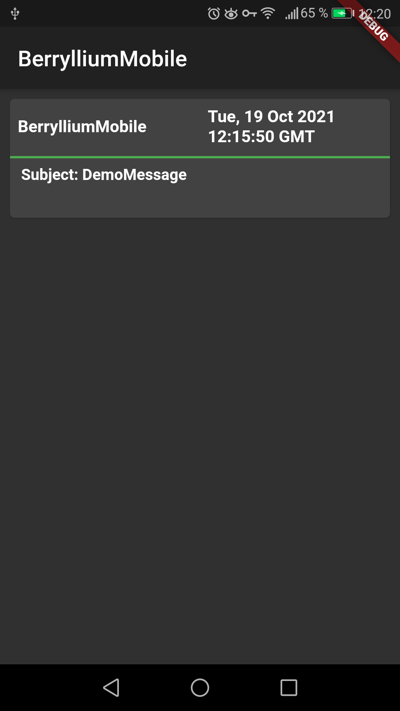

# BerrylliumMobile

## What is it?

BerrylliumMobile is a mobile application designed to display the messages stored on a local server (e.g. Raspberry PI) through the [BerrylliumAPI](https://github.com/AlecGhost/BerrylliumAPI).
The incoming messages are displayed in a list view, showing the sender, the timestamp and the subject.
They can be expanded to see the full content or seen in full view via a double click.

*Img. 1: Example Screenshot*